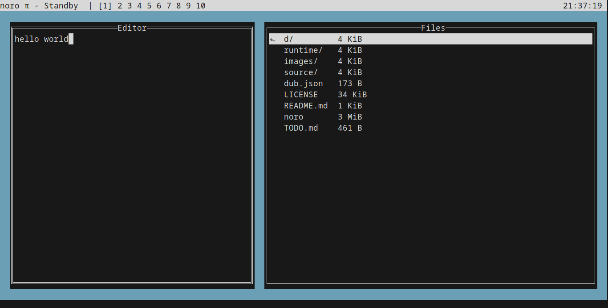

<h1 align="center">noro</h1>

<p align="center">
	
	
	
	<a href="https://justforfunnoreally.dev">
</p>

Noro is a text editor (among other things) that aims to make many common tasks possible
in its environment

The environment is a window manager with workspaces, shown in the screenshot below



## Build
```
dub build
```
This will create a noro executable

## Getting started
Press CTRL+K, then A to open the menu page, then move the cursor down to the survival
guide and then press space to see all of the documentation for noro usage

## Compatibility
### Operating systems
- Linux - works
- macOS - works
- FreeBSD - works
- Windows - not supported

### Terminals
- lxterminal on Linux - works
- alacritty on Linux - works
- konsole on Linux - works
- mlterm on Linux - works, but cursor invisible
- xterm on Linux - works, but some characters are broken
- xterm on FreeBSD - works
- yterm on Linux - doesn't work at all

## Feature plans
- A good text editor
- A file manager
- A music player (maybe)
- An IRC client (maybe? IRC isn't really used much)
- Extendable - loading plugins written in C (maybe) or D
